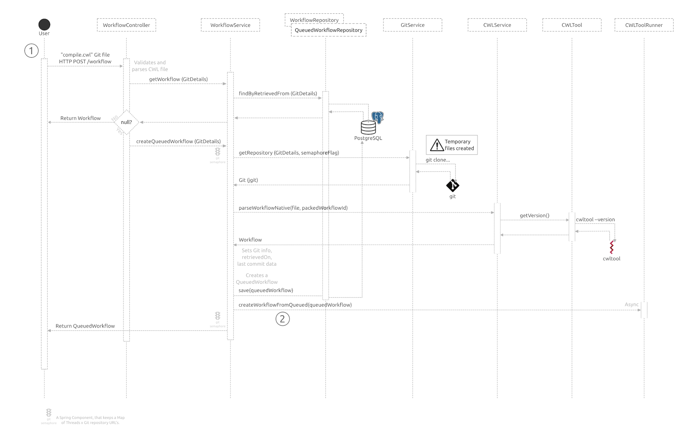
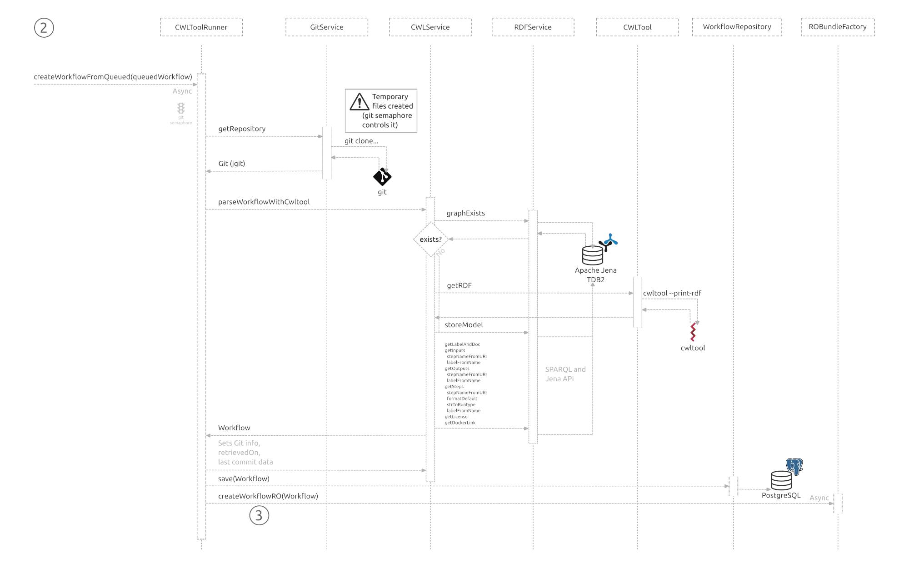
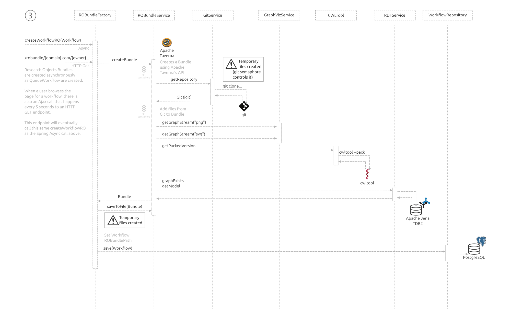

# Diagrams

This folder contains diagrams about functionalities of CWL Viewer.
The source file for the diagrams is stored in a SVG file. We suggest
contributors to use Inkscape to edit the SVG file.

## Flowcharts

When a user submits a workflow to the CWL Viewer, the Spring controller
will handle the request delegating most of the work to Spring services.

The first part of the flow is responsible for validating the request and
checking if the workflow exists in the Postgres database, and if not
creating a `QueuedWorkflow` in the database.

An asynchronous task is then scheduled to parse the CWL workflow with
`cwltool`, use Apache Jena to create the workflow graph, and to store the
`Workflow` object (not queued anymore) in the Postgres database.

This final part of the flow is also an asynchronous task, responsible for
creating the Research Objects bundle file. It uses Apache Taverna API
to create a `Bundle`, and stores parts of the Git repository, graph
images generated by the `cwltool` and Jena graph data, and extra data
for provenance. The result is updated in the `Workflow` object in Postgres.
